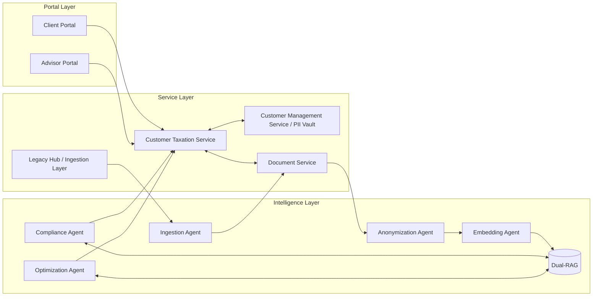
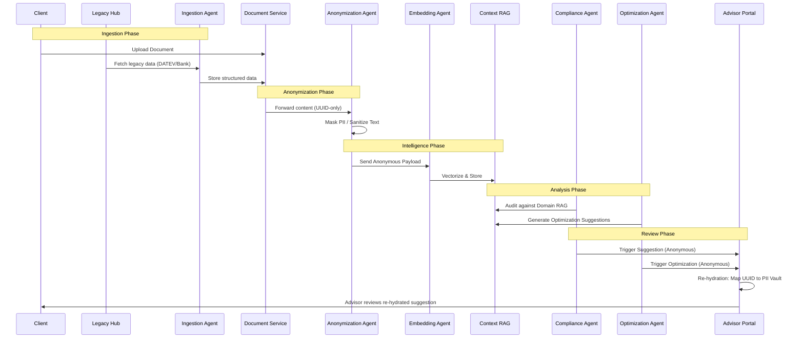

# High-Level Design: Synapse Tax Engine

## 1. System Landscape & Domain Separation

The Synapse Tax Engine is architected as a decoupled, multi-layered system designed to isolate sensitive Personal Identifiable Information (PII) from the AI processing intelligence.

### 1.1 Layered Architecture
*   **Portal Layer (React)**: 
    *   **Advisor Portal**: Suggestion-driven dashboard where tax professionals review AI-generated drafts.
    *   **Client Portal**: Checklist-driven interface for secure document collection and status tracking.
*   **Service Layer**:
    *   **Customer Management Service (PII Vault)**: The authoritative source for PII. It generates deterministic UUIDs for Tenants and Customers, ensuring no real names or IDs leave this boundary.
    *   **Customer Taxation Service**: The central state machine orchestrating the "Road to Filing" workflow and tracking checklist completion.
    *   **Document Service**: Managed S3 storage utilizing tenant-based partitioning and strict pre-signed URL access.
*   **Ingestion Layer**: A legacy integration hub using the **Adapter Pattern** to standardize data from DATEV (Klardaten), SharePoint, and various banking APIs.
*   **Intelligence Layer**: A specialized collective of LLM agents:
    *   **Anonymization Agent**: Mandatory gateway for PII masking.
    *   **Ingestion Agent**: Structured data extraction and OCR.
    *   **Embedding Agent**: Vectorization for Contextual RAG.
    *   **Compliance Agent**: Statutory audit against Domain RAG.
    *   **Optimization Agent**: Tax strategy and deduction identification.
*   **Compliance Layer**: An Anonymization Proxy that intercepts all outgoing AI requests and an immutable Audit Logging service for regulatory accountability.

---

## 2. The Zero-PII Intelligence Pipeline

To comply with **§203 StGB (German Criminal Code)**, the system enforces a strict Zero-PII policy within its intelligence core.

### 2.1 The Mandatory Gateway
The **Anonymization Agent** serves as the exclusive entry point to the Intelligence Layer. Every document and data stream is passed through this agent, which masks or randomizes identifiers before they reach any vector database or downstream agent.

### 2.2 Anonymous Data Processing
*   **Context RAG**: All client-specific historical data is stored in vector indices indexed by UUID only.
*   **Agent Communication**: Downstream agents (Compliance Agent, Optimization Agent) operate solely on anonymized facts.

### 2.3 Re-hydration Process
The "Re-hydration" occurs exclusively at the **Portal Layer**. The UI fetches anonymous suggestions from the Intelligence Layer and queries the **PII Vault** via authorized session tokens to map UUIDs back to human-readable names for the Advisor's review.

---

## 3. Agentic Orchestration & Dual-RAG

The system utilizes a distributed set of specialized agents coordinated through the **Model Context Protocol (MCP)**.

### 3.1 The MCP Bridge
The MCP Server acts as a secure, capability-based bridge. Agents (Ingestion, Compliance, Optimization) do not have direct DB access; they request data via MCP tools that enforce tenant isolation and audit every query.

### 3.2 Dual-Retrieval-Augmented Generation (RAG) Strategy
*   **Domain RAG**: A global index of statutory tax laws, case law, and DATEV guidelines.
*   **Context RAG**: A per-tenant, anonymized index of the client’s financial history, previous filings, and specific tax context.

---

## 4. The "Road to Filing" Workflow

The path from data ingestion to submission is a continuous, automated audit.

1.  **Automated Audit**: The **Compliance Agent** continuously checks ingested data against a predefined checklist for the specific tax year.
2.  **Human-in-the-Loop (HITL)**: When the **Optimization Agent** generates a draft or strategy, it is presented to the Advisor with a confidence score and citations.
3.  **Acceptance/Rejection**: Advisors must explicitly accept or reject suggestions. Rejections feed back into the system to trigger model refinement.
4.  **Final Submission**: The "Submit" button to DATEV or tax authorities is disabled until a human advisor provides explicit authorization, ensuring ultimate legal accountability remains with the professional.

---

## 5. Technical Diagrams

### 5.1 System Context Map

### 5.2 Data Lifecycle Sequence

---

## 6. Vendor Flexibility & Compliance

The architecture maintains **Vendor Flexibility** by abstracting the LLM providers behind the MCP layer. This allows switching between OpenAI, Anthropic, or local models (Llama/Mistral) without re-engineering the service layer. Strict adherence to §203 StGB is maintained by ensuring that no un-masked data ever crosses the Intelligence Layer boundary via the **Anonymization Agent**.
