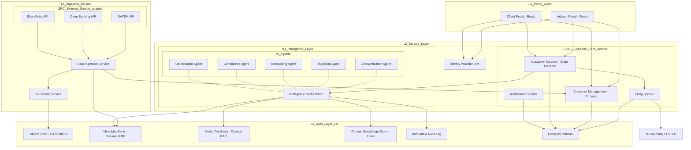

# High-Level Design: Synapse Tax Engine

## 1. Architectural Philosophy: The Technical Copilot
Synapse is architected as an **Intelligence-First Data Platform**. The core principle is the strict separation of the **Deterministic Legal State** from **Non-Deterministic Agentic Reasoning**.

To achieve a 1-year runway with maximum velocity, we adopt a **Modular Monolith** deployment for core services, while maintaining strict domain boundaries that mirror our target **Microservices Architecture**.

---

## 2. Current Deployment: The Modular Monolith (Day 1)
In the initial phase, we co-locate core business logic to minimize "DevOps Tax" and inter-service latency.

### Service Grouping:
1.  **Synapse-Core (Monolith)**:
    * **Customer Management Service**: The "Source of Truth" and PII Vault.
    * **Customer Taxation Service**: The State Machine orchestrating the "Road to Filing."
    * **Notification Service**: Event-driven alerts (Bloomreach/Twilio).
2.  **Intelligence Orchestrator (Satellite)**: Dedicated Python/FastAPI bridge for the Agent Swarm.
3.  **Data Ingestion Service (Satellite)**: High-throughput worker for DATEV, Bank, and SharePoint adapters.
4.  **Document Service (Satellite)**: Stateless S3/MinIO binary management.

---

## 3. Destination Architecture: The Microservices Ecosystem (Target)
As the platform scales to handle the €20B German market, the modules within **Synapse-Core** are extracted into independent, autoscaling microservices.

